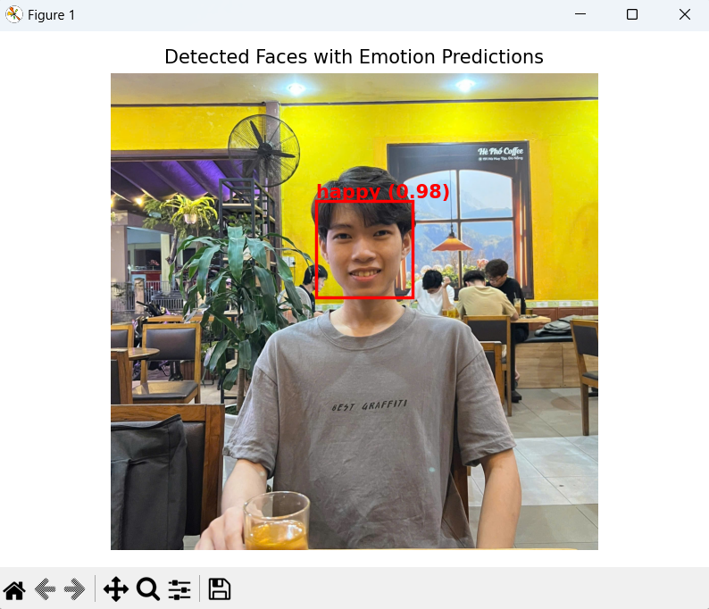

# FaceEmotionNet: Deep Learning for Facial Expression Analysis

This project implements a **Facial Expression Recognition** pipeline using **ResNet**. The pipeline includes **face detection** followed by **expression classification** into seven emotion categories.

## Demo

<table>
<tr>
  <th>Input</th>
  <th>Predict</th>
</tr>
<tr>
  <td></td>
  <td></td>
</tr>
</table>


## Dataset Format

The dataset is described using a file named `label.lst`. Each line in `label.lst` represents one labeled face in an image with the following format:


### Meaning:
- `img_001.jpg`: Image file name
- `0`: ID of the detected face in the image
- `34 45 124 135`: Bounding box (top, left, right, bottom)
- `0.98`: Confidence score of face detection
- `3`: Expression label (see below)

## Expression Labels

Each label corresponds to a facial expression:

| Label | Emotion   |
|-------|-----------|
| 0     | Angry     |
| 1     | Disgust   |
| 2     | Fear      |
| 3     | Happy     |
| 4     | Sad       |
| 5     | Surprise  |
| 6     | Neutral   |

## Pipeline Overview

1. **Face Detection**:  
   - Detect faces in input images (can use MTCNN, RetinaFace, or any preferred detector).
   - Crop the detected face regions based on bounding box info.

2. **Expression Classification**:  
   - Use a fine-tuned **ResNet** model (e.g., ResNet-18 or ResNet-50) to classify the cropped face into one of the 7 emotions.
   - Input: cropped face image  
   - Output: predicted emotion label

## Training

To train the model:

1. Prepare dataset using `label.lst`.
2. Preprocess: detect and crop face regions using the provided bounding boxes.
3. Normalize images and resize them to match ResNet input size (e.g., 224x224).
4. Train the ResNet model using cross-entropy loss and appropriate optimizer.

## Evaluation

- Accuracy and confusion matrix are used to evaluate model performance.
- Optional: Perform evaluation per expression class.

## Citation

If you use this work, please cite the original paper:

```bibtex
@inproceedings{SOCIALRELATION_2017,
  author = {Zhanpeng Zhang, Ping Luo, Chen Change Loy, and Xiaoou Tang},
  title = {From Facial Expression Recognition to Interpersonal Relation Prediction},
  booktitle = {arXiv:1609.06426v2},
  month = September,
  year = {2016}
}
